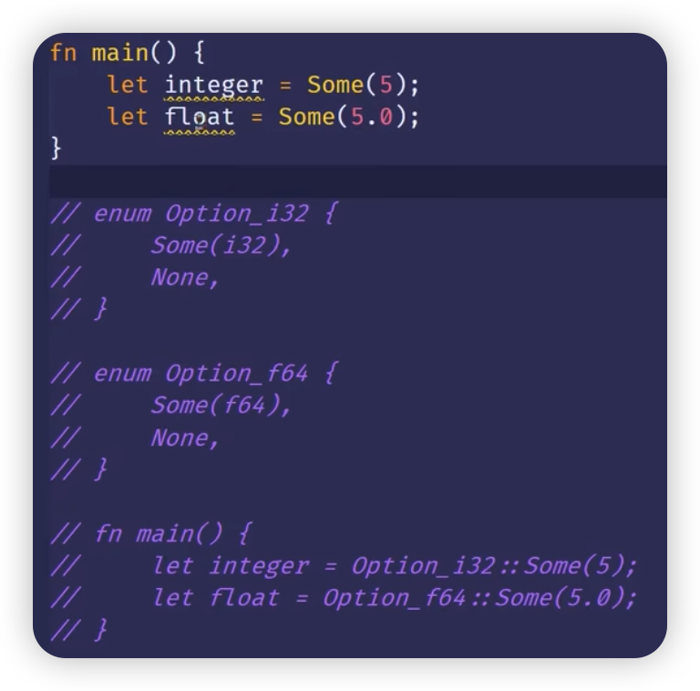

[TOC]

## 泛型
- 泛型：提高代码复用能力
  - 处理重复代码的问题
- 泛型是具体类型或其它属性的抽象代替：
  -  你编写的代码不是最终的代码，而是一种模板，里面有一些“占位符”。
  -  编译器在编译时将“占位符”替换为具体的类型。
- 例如：`fn largest<T>（list: &[T]）-> T｛ ... ｝`
- 类型参数：
  - 很短，通常一个字母
  - CamelCase
  - T：type 的缩写


## 函数定义中的泛型
- 泛型函数：
  - 参数类型
  - ```rust
    fn largest<T>(list: &[T]) -> T {
        let mut largest = list[0];
        for &item in list {
            if item > largest {
                largest = item;
            }
        }
        largest
    }
    ```


## Struct 定义中的泛型
- 可以使用多个泛型的类型参数
  - 太多类型参数：你的代码需要重组为多个更小的单元
-   ```rust
    struct Point<T> {
        x: T,
        y: T,
    }

    fn main() {
        let integer = Point {x: 5, y: 10};
        let float = Point {x: 1.0, y: 4.0};
    }
    ```


## Enum 定义中的泛型
- 可以让枚举的变体持有泛型数据类型
  - 例如 Option<T>，Result<T, E>
-   ```rust
    enum Option<T> {
        Some(T),
        None,
    }

    enum Result<T, E> {
        Ok(T),
        Err(E),
    }
    ```

## 方法定义中的泛型
- 为struct 或 enum 实现方法的时候，可在定义中使用泛型
- 注意：
  - 把 T 放在 impl 关键字后，表示在类型T上实现方法
    - 例如：`impl<T> Point<T>`
  - 只针对具体类型实现方法（其余类型没实现方法）：
    - 例如：`impl Point<f32>`
- struct 里的泛型类型参数可以和方法的泛型类型参数不同
- ```rust
  struct Point<T> {
    x: T,
    y: T,
  }

  impl<T> Point<T> {
    fn x(&self) -> &T {
        &self.x
    }
  }

  impl Point<i32> {
    fn x1(&self) -> &i32 {
        &self.x
    }
  }

  impl<T, U> Point<T, U> {
    fn mixup<V, W>(&self, other: Point<V, W>) -> Point<T, W> {
        Point {
            x: self.x,
            y: other.y
        }
    }
  }
  ```


## 泛型代码的性能
- 使用泛型的代码和使用具体类型的代码运行速度是一样的。
- 单态化 （monomorphization）
    - 在编译时将泛型替换为具体类型的过程
- 
    