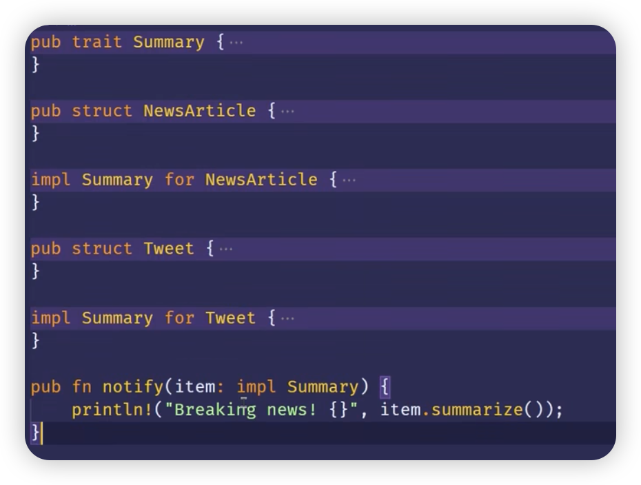

[TOC]

## Trait 作为参数
- 
  - 如上所示，`pub fn notify(item: impl Summary)` 方法指定参数item需要实现了**Summary trait**的类型。
  - impl Trait 语法：适用于简单情况
- Trait bound 语法：可用于复杂情况
  - ```rust
    pub fn notify<T: Summary>(item: T) {
        println!("Breaking news! {}", item.summarize());
    }
    ```
  - impl Trait 语法是 Trait bound 的语法糖
- 使用 ＋ 指定多个 Trait bound
  - ```rust
    use std::fmt::Display;

    pub trait Summary {}

    pub fn notify(item: impl Summary + Display) { ... }

    pub fn notify1<T: Summary + Display>(item1: T) { ... }
    ```
- Trait bound 使用 where 子句
  - 在方法签名后指定 where 子句
  - ```rust
    pub fn notify<T: Summary+Display, U: Clone+Debug>(a: T, b: U) -> String {
      format!("Breaking news! {}", a.summarize())
    }

    pub fn notify2<T, U>(a: T, b: U) -> String 
      where: T: Summary + Display,
        T: Clone + Debug,
    {
      format!("Breaking news! {}", a.summarize())
    }
    ```


## 实现 Trait 作为返回类型
- impl Trait 语法
- 注意：impl Trait 只能返回确定的同一种类型，返回可能不同类型的代码会报错
- ```rust
  fn returns_summarizable() -> impl Summary {
  }
  ```

## 使用 Trait Bound 的例子
- 例子：使用 Trait Bound 修复 largest 函数
  - ```rust
    // 这里的参数必须是基础类型
    fn largest<T: PartialOrd + Copy> (list: &[T]) -> T {
      let mut largest = list[0];
      
      for &item in list.iter() {
        if item > largest {
          largest = item;
        }
      }
      
      largest
    }

    // 复杂类型，第一种
    fn largest<T: PartialOrd + Clone> (list: &[T]) -> T {
      let mut largest = list[0].clone();
      
      for item in list.iter() {
        if item > &largest {
          largest = item.clone();
        }
      }

      largest
    }
    ```

    // 复杂类型，第二种
    fn largest<T: PartialOrd + Clone> (list: &[T]) -> &T {
      let mut largest = &list[0];
      
      for item in list.iter() {
        if item > &largest {
          largest = item;
        }
      }

      largest
    }
    ```


## 使用 Trait Bound 有条件的实现方法
- 在使用泛型类型参数的 impl 块上使用 Trait bound，我们可以有条件的为实现了特定 Trait 的类型来实现方法
- ```rust
  use std::fmt::Display;

  struct Pair<T> {
    x: T,
    y: T,
  }

  impl<T> Pair<T>  {
    fn new(x: T, y: T) -> Self {
      Self {x, y}
    }
  }
  
  impl<T: Display + PartialOrd> Pair<T> {
    fn cmp_display(&self) {
      if self.x >= self.y {
        println!("The largest member is x = {}", self.x);
      } else {
        println!("The largest member is y = {}", self.y);
      }
    }
  }
  ```
  - 也可以为实现了其它 Trait 的任意类型有条件的实现某个 Trait
  - 为满足 Trait Bound 的所有类型上实现 Trait 叫做覆盖实现 （blanket implementations）


## tjl
   - **=**运算符是copy，对于基础类型
   - **=**在复杂类型上是clone  