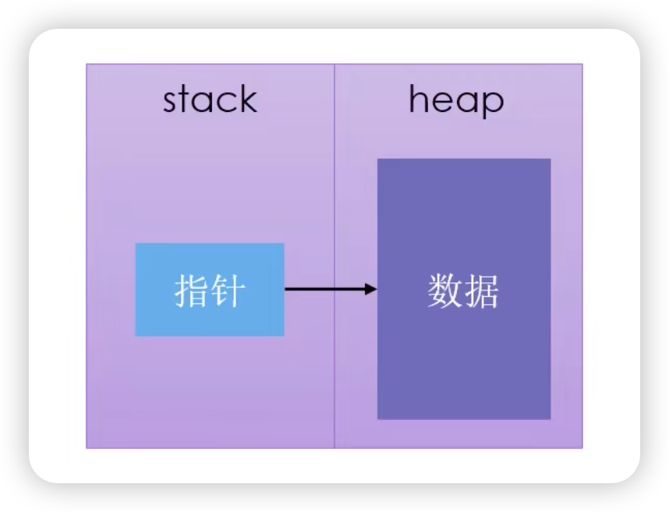
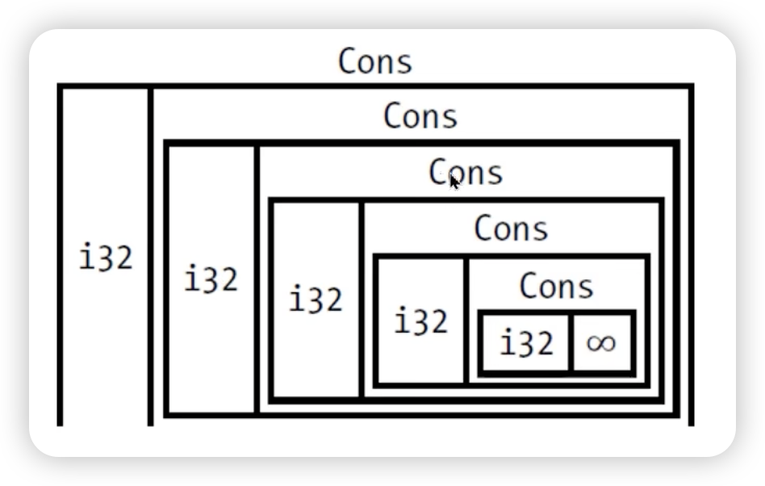
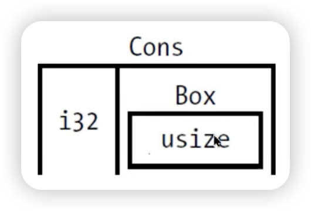

## Box<T>

- Box<T＞ 是最简单的智能指针：
  - 允许你在 heap 上存储数据（而不是 stack）
  - stack 上是指向 heap 数据的指针
  - 没有性能开销
  - 没有其它额外功能
  - 实现了 Deref frait 和 Drop trait




## Box<T> 的常用场景
- 在编译时，某类型的大小无法确定。但使用该类型时，上下文却需要知道它的确切大小。
- 当你有大量数据，想**移交**所有权，但需要确保在操作时数据不会被**复制**。
- 使用某个值时，你只关心它是否实现了特定的 frait，而不关心它的具体类型。


## 使用 Box<T>在 heap 上存储数据
```rust
fn main() {
    let b = Box::new(5);
    println!("b = {}", b);
}
```


## 使用 Box 赋能递归类型
- 在编译时，Rust 需要知道一个类型所占的空间大小。
- 而递归类型的大小无法在编译时确定。
- 但 Box 类型的大小确定
- 在递归类型中使用 Box 就可解决上述问题。
  - 函数式语言中的 Cons List。




## 关于 Cons List
- Cons List 是来自 Lisp 语言的一种数据结构。
- Cons List 里每个成员由两个元素组成。
  - 当前项的值
  - 下一个元素
- Cons List 里最后一个成员只包含一个 **Nil** 值，没有下一个元素。


## Cons Lis+ 并不是 Rust 的常用集合
- 通常情况下，Vec<T> 是更好的选择
- （例子）创建一个 Cons List
  - ```rust
    use crate::List::{Cons, Nil};

    fn main() {
        let list = Cons(1, Cons(2, Cons(3, Nil)));
    }

    enum List {
        Cons(i32, List),
        Nil,
    }
    ```
- （例）Rust 如何确定为枚举分配的空间大小
  - ```rust
    enum Message {
        Quit, 
        Move { x: i32, y: i32 },
        Write(String),
        ChangeColor(i32, i32, i32),
    }
    ```

## 使用 Box 来获得确定大小的递归类型
- Box<T>是一个指针，Rust 知道它需要多少空间，因为:
  - 指针的大小不会基于它指向的数据的大小变化而变化。



- Box<T>
  - 只提供了“间接”存储和 heap 内存分配的功能
  - 没有其它额外功能
  - 没有性能开销
  - 适用于需要“间接”存储的场景，例如 Cons List
  - 实现了 Deref trait 和 Drop trait


