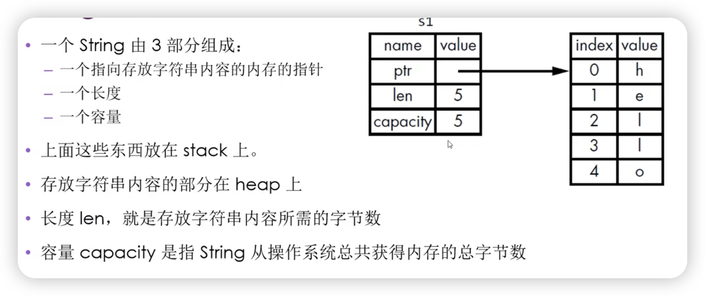
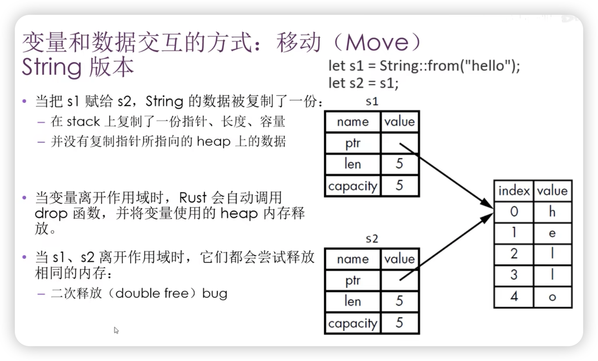
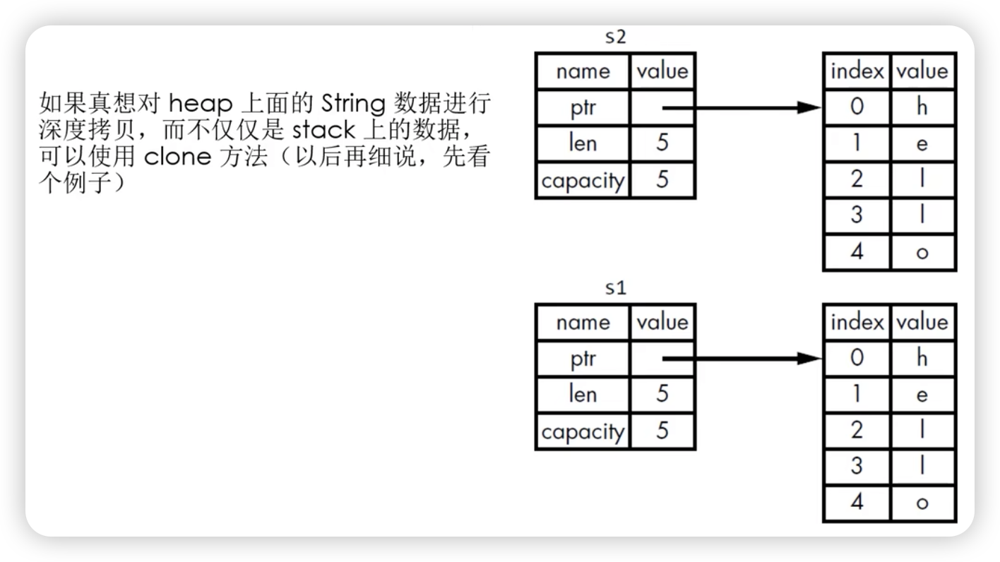

[TOC]

## 所有权规则
- 每个值都有一个变量，这个变量是该值的所有者.
- 每个值同时只能有一个所有者.
- 当所有者超出作用域（scope）时，该值将被删除.


## 变量作用域
- Scope （作用域 ｜ 生命周期） 就是程序中一个项目的有效范围.


## String 类型
- String 比那些基础标量数据类型更复杂.
- 字符串字面值：程序里手写的那些字符串值。它们是不可变的.
- Rust 还有第二种字符串类型：String.
  - 在 heap 上分配。能够存储在编译时末知数量的文本.


## 创建 String 类型的值
- 可以使用 from 函数从字符串字面值创建出 String 类型
- `let s = String::from（"hello"）;`
  - `:` 表示 from 是 String 类型下的函数
-  这类字符串是可以被修改的
-  为什么 String 类型的值可以修改，而字符串字面值却不能修改？
   -  因为它们处理内存的方式不同


## 内存和分配
- 字符串字面值，在编译时就知道它的内容了，其文本内容直接被硬编码到最终的可执行文件里
  - 速度快、高效, 是因为其不可变性。
- String 类型，为了支持可变性，需要在 heap 上分配内存来保存编译时未知的文本内容:
  - 操作系统必须在运行时来请求内存
    - 这步通过调用 `String::from` 来实现
  - 当用完 String 之后，需要使用某种方式将内存返回给操作系统
    - 这步，在拥有GC 的语言中，GC 会跟踪并清理不再使用的内存
    - 没有GC，就需要我们去识别内存何时不再使用，并调用代码将它返回
      - 如果忘了，那就浪费内存.
      - 如果提前做了，变量就会非法.
      - 如果做了两次，也是 Bug。必须一次分配对应一次释放.
- Rust 采用了不同的方式：对于某个值来说，当拥有它的变量走出作用范围时，内存会立即自动的交还给操作系统.
- `drop` 函数


## 变量和数据交互的方式：移动（Move）
- 多个变量可以与同一个数据使用一种独特的方式来交互
``` rust
let x = 5；// 绑定
let y = x；
```
- 整数是已知且固定大小的简单的值，这两个数值 `5` 被压到了 stack 中
``` rust
let s1 = String::from("hello");
let s2 = s1;
``` 





- 为了保证内存安全：
  - Rust 没有尝试复制被分配的内存
  - Rust 让旧的 s1 的所有权拥有者（变量）失效
    - 当 s1 离开作用域的时候，Rust 不需要释放任何东西
- 试试看当 s2 创建以后 再使用 s1 是什么效果


- 浅拷贝 （shallow copy）
- 深拷贝 （deep copy）
- 你也许会将复制指针、长度、容量视为浅拷贝，但由于 Rust 让 s1 失效了，所以我们用一个新的术语：移动（Move）

- 隐含的一个设计原则：Rust 不会自动创建数据的深拷贝
  - 就运行时性能而言，任何自动赋值的操作都是廉价的
 


## 变量和数据交互的方式：克隆 （Clone）
+ 如果真想对 heap 上面的 String 数据进行深度拷贝，而不仅仅是 stack 上的数据，可以使用 clone 方法（以后再细说，先看个例子）

## clone



## Stack 上的数据：复制
- Copy trait，可以用于像整数这样完全存放在 stack 上面的类型
- 如果一个类型实现了 Copy 这个 trait，那么旧的变量在赋值后仍然可用
- 如果一个类型或者该类型的一部分实现了 Drop trait，那么 Rust 不允许让它再去实现 Copy trait 了


## 一些拥有 Copy trait 的类型
- 任何简单标量的组合类型都可以是 Copy 的
- 任何需要分配内存或某种资源的都不是 Copy 的
- 一些拥有 Copy trait 的类型：
  - 所有的整数类型，例如 u32
  - bool
  - char
  - 所有的浮点类型，例如f64
  - Tuple（元组），如果其所有的字段都是 Copy 的
    - （i32, i32） 是
    - （i32, String）不是
