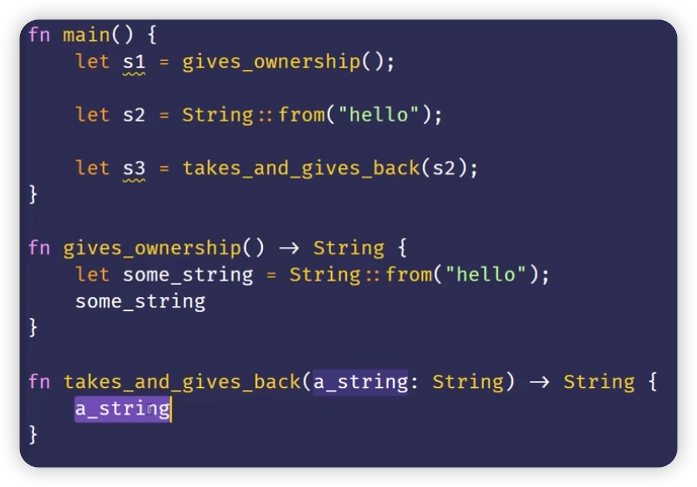

[TOC]

## 所有权与函数
- 在语义上，将值传递给函数和把值赋给变量是类似的：
  - 将值传递给函数将发生**移动**或**复制**

- 其中`s`的所有权被移动到函数`take_ownership`中。当 `take_ownership` 返回时，其中的 `some_string` 的作用域结束，从而导致 `s` 的所有权被释放；

## 返回值与作用域
- 函数在返回值的过程中同样也会发生所有权的转移
- 一个变量的所有权总是遵循同样的模式：
  - 把一个值赋给其它变量时就会发生移动
  - **当一个包含 heap 数据的变量离开作用城时，它的值就会被 drop 函数清理，除非数据的所有权移动到另一个变量上了**

- 所有权可以通过 `函数传入` 和 `函数返回` 移动，从而保持所有权不被释放；

