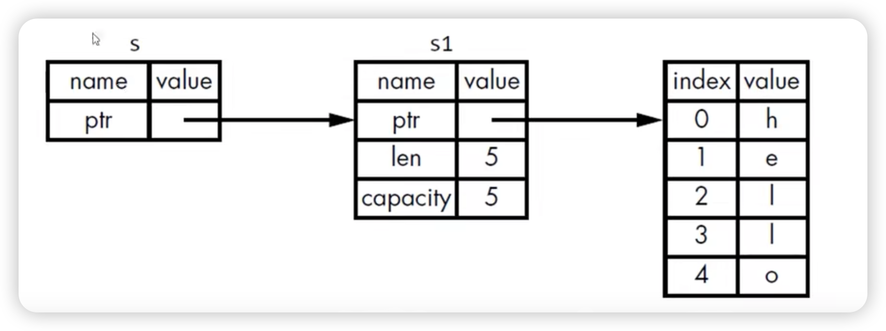

## 如何让函数使用某个值，但不获得其所有权？

- Rust 有一个特性叫做: `引用 （Reference）`


## 4.2 引用和借用
- 参数的类型是 &String 而不是 String
- `＆`符号就表示引用: 允许你引用某些值而不取得其所有权




## 借用
- 我们把引用作为函数参数这个行为叫做借用
- 借用不具有指向的所有权，指向值不会被销毁；
- 是否可以修改借用的东西？（例子）
  - 不可以
- 和变量一样，引用默认也是不可变的

## 可变引用
- 可变引用有一个重要的限制：在特定作用域内，对某一块数据，只能有一个变的引用。
  - 这样做的好处是可在编时防止数据竞争。
- 以下三种行为下会发生数据竞争：
  - 两个或多个指针同时访问同一个数据
  - 至少有一个指针用于写入数振
  - 没有使用任何机制来同步对数据的访问
- 可以通过创建新的作用域，来允许非同时的创建多个可变引用

``` rust
fn main() {
    let mut s = String::from("hello");
    {
        let s1 = &mut s;
    }
    let s2 = &mut s; 
}
```


## 另外一个限制
- 不可以同时拥有一个可变引用和一个不变的引用
- 多个不变的引用是可以的


## 悬空引用 Dangling References
- 悬空指针（Dangling Pointer）：一个指针引用了内存中的某个地址，而这块内存可能已经释放并分配给其它人使用了。
- 在 Rust 里，编译器可保证引用永远都不是悬空引用：
  - 如果你引用了某些数据，编译器将保证在引用离开作用域之前数据不会离开作用域

``` rust
fn main() {
    let r = dangle();
}

fn dangle() -> &String {
    let s = String::from("hello");
    &s // 编译器会报错
}
```


## 引用的规则
- 在任何给定的时刻，只能满足下列条件之一：
  - 一个可变的引用
  - 一任意数量不可变的引用
- 引用必须一直有效
  

## 借用必须始终遵循所有者的生命周期

当所有者变量的作用域结束时，它的所有权将被释放，这意味着它所拥有的资源（如果有的话）将被清理。如果在此时有活跃的借用，Rust 的编译器会在编译时检查并拒绝这种情况，从而防止悬挂引用。

下面是一个展示借用和所有权释放的例子：
``` rust
fn main() {
    let mut owner = String::from("Hello, World!");

    // 不可变借用
    let borrow = &owner;
    println!("Borrowed value: {}", borrow);

    // 可变借用
    let mut borrow_mut = &mut owner;
    *borrow_mut = String::from("Hello, Rust!");
    println!("Mutably borrowed value: {}", borrow_mut);

    // `owner` 的作用域在这里结束，`borrow` 和 `borrow_mut` 的借用也同时结束。
    // Rust 编译器确保在这个时候没有活跃的借用。
}
```

在这个例子中，owner 是一个 String 类型的变量，它拥有堆上的数据。borrow 是一个不可变借用，而 borrow_mut 是一个可变借用。在这个例子中，借用者在 owner 的作用域结束之前就已经结束了，这是完全合法的。

如果你尝试在 owner 的作用域结束之前结束借用，Rust 编译器会报错。例如：

``` rust
fn main() {
    let mut owner = String::from("Hello, World!");
    let borrow;

    {
        let inner_owner = String::from("Inner Hello");
        borrow = &inner_owner; // 不可变借用 `inner_owner`
    } // `inner_owner` 的作用域在这里结束，它被释放

    // 编译错误：借用 `borrow` 悬挂，因为 `inner_owner` 已经被释放
    println!("Borrowed value: {}", borrow);
}
```

在这个例子中，inner_owner 的作用域在内部块中结束，但是 borrow 的作用域尝试超出 inner_owner 的作用域。Rust 编译器会检测到这种悬挂引用，并拒绝编译代码。

通过这些规则，Rust 确保了内存安全，同时避免了悬挂引用和数据竞争的问题。