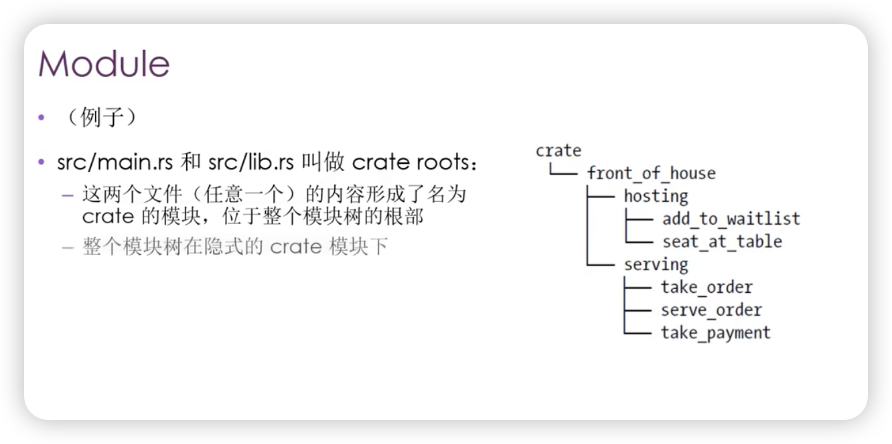

[TOC]


## Rust 的代码组织
- 代码组织主要包括：
  - 哪些细节可以暴露，哪些细节是私有的
  - 作用域内哪些名称有效
  - ...
- 模块系统：
  - Package（包）：Cargo 的特性，让你构建、测试、共享 crate
  - Crate（单元包）：一个模块树，它可产生一个 library 或可执行文件
  - Module（模块）、use：让你控制代码的组织、作用域、私有路径
  - Path（路径）：为struct、 function 或 module 等项命名的方式


## Pacakge 和 Crate
- Crate 的类型：
  - binary
  - library
- Crate Root：
  - 是源代码文件（`src/main.rs` 或 `src/lib.rs`）
  - Rust 编译器从这里开始，组成你的 Crate 的根 Module
- 一个 Package 
  - 包含 1 个 Cargo.toml(可以使用 `cargo new xxx` 创建)，它描述了如何构建这些 Crates
  - 只能包含**0-1**个 library crate
  - 可以包含**任意数量**的 binary crate
  - 但必须**至少**包含一个 crate （library 或 binary）


## Cargo 的惯例
- `src/main.rs`：
  - binary crate 的 crate root
  - crate 名与 package 名相同
- `src/lib.rs`：
  - package 包含一个 library crate
  - library crate 的 crate root
  - crate 名与 package 名相同
- Cargo 把 crate root 文件交给 rustc 来构建 library 或 binary.
- 一个 Package 可以同时包含 src/main.rs 和 src/lib.rs
  - 一个 binary crate，一个 library crate
  - 名称与 package 名相同
- 一个 Package 可以有多个 binary crate：
  - 文件放在 `src/bin`
  - **每个文件是单独的 binary crate**


## Crate 的作用
- 将相关功能组合到一个作用域内，便于在项目间进行共享
  - 防止冲突
- 例如 rand crate，访问它的功能需要通过它的名字：rand


## 定义 module 来控制作用域和私有性
- Module：
  - 在一个 crate 内，将代码进行分组
  - 增加可读性，易于复用
  - 控制项目（item）的私有性。public、 private
- 建立 module：
  - mod 关键字
  - 可嵌套
  - 可包含其它项（struct、enum、常量、trait、函数等）的定义
- 例子
  ``` rust
  mod front_of_house {
    mod hosting {
        fn add_to_waitlist() {}
        fn seat_at_table() {}
    }

    mod serving {
        fn take_order() {}
        fn serve_order() {}
        fn take_payment() {}
    }
  }
  ```




- `src/main.rs` 和 `src/lib.rs` 叫做 crate roots：
- 这两个文件（任意一个）的内容形成了名为crate 的模块，位于整个模块树的根部
- 整个模块树在隐式的 crate 模块下